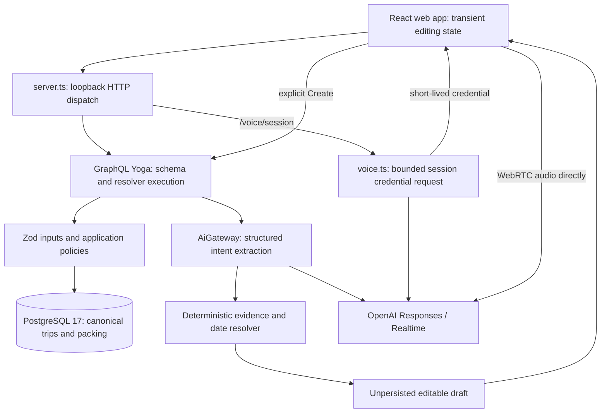
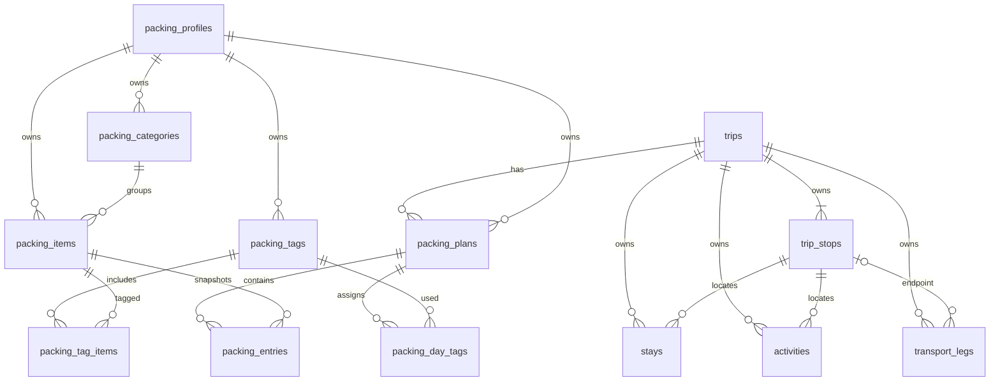

# Backend baseline map

## Assessment

TripDock has a sound small-product foundation: one API process, one canonical PostgreSQL database, an explicitly injected AI boundary, server validation, trip revisions, and deterministic date interpretation. Replacing this with microservices, a new framework, a message bus or a generic repository layer would add coordination cost without solving a demonstrated problem.

The main maintainability problem at `f80de19` was responsibility concentration. `src/graphql.ts` had 1,038 lines mixing SDL, Zod inputs, error conversion, date policies, SQL helpers and every itinerary mutation. `src/trip-creation.ts` had 2,066 lines mixing the provider/request vocabulary, calendar resolution, evidence verification and final draft assembly. These are different reasons to change a file, so unrelated work naturally collided there.

This review uses the actual baseline source as authority for behavior. The older untracked MVP review at `C:/Users/Ramon/trip-dock/docs/mvp-review-2026-09-09.md` was read and preserved. Its transport gap has since been addressed by migration 0002 and external endpoints. Its stricter destination-readiness and zero-night proposals are not assumed to be current requirements. Historical README/prototype/ADR text also predates packing and dictation in places; the ADR's existing-trip proposal design is explicitly superseded.

## System and trust boundaries

The process binds to `127.0.0.1`; configuration comes from server-only environment variables. GraphQL has a configured CORS origin and development-only GraphiQL. This is a personal local runtime, not an authenticated shared service. Child-to-trip foreign keys are integrity protections; the fixed packing profile is a local ownership namespace. Neither establishes account identity.

Voice is an intentional second provider path. `OpenAiGateway` owns trip interpretation, while `voice.ts` directly requests a Realtime client credential. The browser streams audio to OpenAI, not through the TripDock API. Documentation that calls `OpenAiGateway` the only production OpenAI path should be read as referring to trip drafting.

## Responsibility inventory

Paths below are under `apps/api`. Baseline line references can be inspected with `git show f80de19:apps/api/src/graphql.ts` and equivalent paths; the linked files show the reviewed result.

| Concern | Baseline location | Assessment and resulting home |
| --- | --- | --- |
| HTTP composition | [src/server.ts](../../../apps/api/src/server.ts) | Small, explicit dependency construction and route dispatch; retain. Shutdown ordering is a follow-up. |
| Configuration | [src/config.ts](../../../apps/api/src/config.ts) | Validates port and HTTP(S) origin, normalizes origin, leaves manual work available without AI configuration. Importing the module loads `.env`; parsing is tied to `process.env`. |
| GraphQL schema | `graphql.ts:33–258` | Preserve SDL exactly; now [graphql/schema.ts](../../../apps/api/src/graphql/schema.ts). Includes deprecated reorder, nullable traveler count and external transport endpoints. |
| Input validation | `graphql.ts:260–331` | Request shapes and endpoint rules now in [trips/inputs.ts](../../../apps/api/src/trips/inputs.ts); reuse existing `domain.parseInput`. |
| Error mapping | `graphql.ts:333–355`, `packing-data.ts:20` | Duplicate domain/Zod conversion; now one [GraphQL boundary](../../../apps/api/src/graphql/errors.ts). Packing retains its feature-specific duplicate-name policy. |
| Trip locking and chronology | `graphql.ts:359–554` | Retain parent-lock/revision protocol; now [trips/transactions.ts](../../../apps/api/src/trips/transactions.ts), with pure rules in [policy.ts](../../../apps/api/src/trips/policy.ts). |
| Itinerary commands | `graphql.ts:556–992` | Now [trip service](../../../apps/api/src/trips/trip-service.ts), [stop service](../../../apps/api/src/trips/stop-service.ts), [itinerary service](../../../apps/api/src/trips/itinerary-service.ts). SQL stays close to the command it implements. |
| Read model | [src/data.ts](../../../apps/api/src/data.ts) | Builds complete trip views. Baseline list query selected IDs then hydrated every trip independently; fixed to five collection SELECTs. |
| Shared primitives | [src/domain.ts](../../../apps/api/src/domain.ts) | Small error vocabulary, ISO dates/timestamps, timezone checks, chronology comparator and parsing helper; retain. |
| AI transport | [src/ai.ts](../../../apps/api/src/ai.ts) | Interface plus production/unconfigured/test adapters. Strict structured extraction, refusal/status/error classification, no DB access. |
| Draft interpretation | `trip-creation.ts` | Now feature files for [schemas](../../../apps/api/src/trip-creation/schemas.ts), [calendar](../../../apps/api/src/trip-creation/calendar.ts), [evidence](../../../apps/api/src/trip-creation/evidence.ts), [assembly](../../../apps/api/src/trip-creation/resolve-draft.ts), [service](../../../apps/api/src/trip-creation/service.ts). Public barrel preserves callers. |
| Packing | [packing-data.ts](../../../apps/api/src/packing-data.ts), [packing-domain.ts](../../../apps/api/src/packing-domain.ts), [packing-catalog.ts](../../../apps/api/src/packing-catalog.ts) | Domain calculations are already pure. Data module combines queries, bootstrap, resolver adapters and commands in dense code; further separation can follow an actual packing change. |
| Persistence | [db/schema.ts](../../../apps/api/src/db/schema.ts), [db/packing-schema.ts](../../../apps/api/src/db/packing-schema.ts), [db/client.ts](../../../apps/api/src/db/client.ts) | Explicit constraints and injected Drizzle DB handle. Schema re-export cycle relies on deferred FK callbacks; not changed. |

## Persistence and revisions

The diagram describes application ownership, not every database minimum cardinality. In particular, SQL does not enforce that a trip has at least one stop; application commands do. Transport has two independently constrained endpoints, each a stop or external location, with at least one stop. Composite child FKs include `tripId`, preventing attachment to another trip's stop. Deleting a stop cascades its related stays, activities and transport; deleting a trip also removes its packing plans while preserving the library.

Five immutable migrations cover the baseline, nullable travelers, external transport endpoints, activity duration, and packing. Legacy `ai_proposals` and `ai_proposal_operations` remain for reproducibility, with no runtime operations. Unique position constraints exist for trip stops/transport and per-stop stays/activities. There is some index overlap with unique indexes; it does not justify a speculative migration without measuring writes and query plans.

Trip edits serialize on the parent row with `FOR UPDATE`, compare `expectedRevision`, validate ownership and business rules, then bump the revision once. Baseline responses loaded the trip after commit, allowing a second writer or deletion to change what the first command returned. The reviewed implementation reads the response before releasing the transaction lock. This is response correctness; it does not imply concurrent users or authentication.

Packing uses separate library and plan revisions. Plan changes lock trip, then profile, then plan; library edits lock only profile. Initialization inserts the local profile once and creates the starter catalog transactionally. The catalog is a library template, not a trip fixture. Fingerprints include relevant calculation inputs; regeneration preserves manual overrides and marks incompatible old entries for review.

## Domain behavior and validation

Trip creation needs a name, area and at least one stop. Dates may be supplied at trip level or derived from chronological stop boundaries; all supplied stop dates must fall within the trip. Stops may remain undated under the current API. Zero-length date ranges are valid in storage, but extracted duration values still start at one. These are existing product semantics, not changes made by this review.

Stops sort by arrival/departure date and then stored position. Boundary edits propagate only to untouched linked values; stop edits can update an adjacent linked arrival. Adding/removing a boundary stop can change trip bounds. The deprecated reorder mutation validates membership but still orders by chronology. These rules deserve names and behavioral tests because a generic CRUD abstraction would conceal them.

GraphQL validates the document's structure; Zod checks UUIDs, lengths, nullable fields, timestamps, timezones and request semantics. Server policies check ownership, date ranges, endpoint combinations and revisions. PostgreSQL constraints are a final integrity guard. TypeScript types alone do not validate wire data. Domain errors are deliberate public messages; unknown SQL/provider errors must stay opaque.

AI extraction is bounded by an 8,000-character prompt and strict schemas. Intent values include source evidence and provenance; deterministic code checks wording, city/country distinctions, date boundaries, durations and ambiguity before producing field states/questions. Locale/reference date are authoritative request context; `timeZone` is validated but calendar arithmetic relies on the supplied local reference date, not server wall time. The minimum-viability rule still allows unresolved nonblocking destination dates. The large final assembler remains a cohesive but complex policy function after extraction; changing readiness deserves a separate product slice.

## Testing, operations and security findings

The baseline gate passed 182 tests with one explicit PostgreSQL test skipped. API tests use pg-mem with adapters for row arrays/type parsing and a backup-based rollback simulation. This is useful deterministic coverage, but the simulated transaction does not prove real isolation. The explicit suite runs all migrations twice, tests packing/itinerary behavior and checks upgrades of existing rows. It rebuilds its configured test schemas, so selecting an isolated target is essential.

The OpenAI adapter sets a 30-second timeout and one retry, so total wall time can exceed 30 seconds. The live smoke and semantic eval are separate, potentially billed commands; none was run here. The four-scenario live corpus is not broad evidence of multilingual or ambiguous-date model quality. Injected fixtures test the application boundary, not provider availability.

Voice bounds request bytes/context, checks exact Origin, limits attempts/concurrency, cancels on disconnect, and returns a no-store short-lived credential. Its model/delay settings remain unchanged. It still combines HTTP parsing and provider adaptation; at 83 lines it did not need a framework or multi-file rewrite. Follow-up robustness cases include split UTF-8 request chunks and stricter upstream credential-shape validation.

GraphQL CORS headers do not constitute explicit request authorization. Unlike voice, GraphQL does not explicitly reject a foreign Origin before execution. Queries have no pagination, depth/complexity limit or app-owned AI request concurrency budget. Those are relevant local hardening/pilot considerations, not evidence that the local app has a complete security boundary. A shared pilot requires separately authorized identity, trip authorization, spend controls and backup work.

Operational visibility is minimal: startup/shutdown logs, `logging: false` in Yoga, and no structured error/latency sink. There is no DB pool idle-error handler, connection/statement deadline or fully ordered HTTP drain before pool shutdown. These are specific follow-ups, with recovery tests, rather than a reason to install a telemetry platform. Lint currently disables unused-variable checking; strict TypeScript is enabled, but lint success alone says little about architecture quality.
