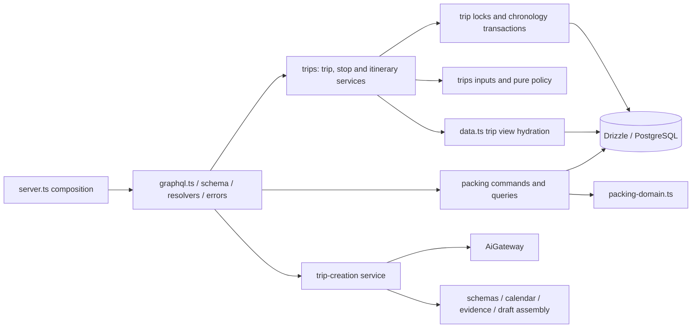

# Target architecture and decisions

## Target

Keep a modular single-process API backed by PostgreSQL. The frontend speaks the same GraphQL contract, application commands own transactions, pure functions express business policy, and provider adapters produce untrusted inputs for deterministic interpretation. The target optimizes for finding the right place to make a change, reviewing it without unrelated churn, and testing the guarantee at its actual boundary.

These modules are a navigational convention, not a prohibition on direct SQL. A command that updates a stay can show its validation, parent lock, ownership query, write, revision bump and readback in one place. There is no generic repository class hiding which transaction performs those steps. `data.ts` is a dedicated read model because its hydration logic is reused, not because every table needs a wrapper.

The old `trip-creation.ts` import path remains a compatibility barrel. Existing tests, provider code and evals can migrate imports when touched; no simultaneous call-site churn is needed. The draft assembler remains 914 lines and evidence checking 613 lines. Their size reflects substantive policy; the next split should follow a specific product change, not a file-length threshold.

## Decisions and tradeoffs

| Decision | Alternatives considered | Chosen default and reason | Complication / rollback |
| --- | --- | --- | --- |
| Organize itinerary commands by feature responsibility | Keep monolith; only move SDL; adopt DI/framework; table repositories | Separate trip, stop and itinerary services with shared pure policies and lock helpers. Makes business flow directly testable without transport dependencies. | More files/imports, but stable entry points. Revert the backend implementation commit as a unit; no data migration. |
| Keep one GraphQL error boundary | Duplicate feature handling; expose raw exceptions; custom error framework | Share expected `AppError`/Zod conversion, preserve packing-specific name conflicts, keep unexpected errors masked. | Development stack traces no longer reach the browser; add safe server diagnostics separately. Rollback can restore previous masking, but would reintroduce leakage. |
| Stable trip reads | Read Committed across statements; one large joined query; blanket Serializable | Read-only Repeatable Read for each trip query. Existing writes retain explicit parent locks and Read Committed. | Adds BEGIN/COMMIT and one checked-out client per query; no claim about unrelated fields sharing a snapshot. Reverting the resolver snapshot would reintroduce mixed views. |
| Return mutations' own view | Post-commit pool read; version-tagged retry reads; fetch-only client response | Hydrate within the write transaction before lock release. Preserves API shape and avoids returning a later command's data. | Holds parent lock during child reads. No DB migration; moving readback outside reverses the change but loses the guarantee. |
| Batch trip collection reads | Global cache; DataLoader; relational query API | Five explicit SELECTs with grouping by trip ID. Solves demonstrated query fan-out without cache invalidation. | Full collection remains unpaginated. Future projection/pagination should keep the snapshot boundary. |
| Resequence positions safely | Deferrable uniqueness migration; delete/reinsert stops; row-count offset | Offset above largest existing position, then assign dense positions. Retains identities and existing constraints. | Two write phases inside one transaction. Old offset reproduces a unique violation after deleting a middle stop. Do not revert this fix independently without accepting that defect. |
| Split deterministic trip creation without behavior changes | Rewrite parser; new AI framework; universal dates/holiday library | Separate vocabulary, calendar, evidence and assembly; preserve every original declaration's logic. | Cross-module exports are now explicit; the assembler is still complex. No prompt/model/schema-version change, and a full semantic corpus remains valuable. |
| Preserve local runtime and migrations | Hosted infrastructure; auth scaffolding; DB/schema reset | Keep existing local-only boundary and five migrations unchanged. Use a dedicated test container. | Local origin protection and operational resilience still need focused work. Shared pilot requires separate product/security authorization. |

## Prioritized implementation plan

### Completed in this branch

1. Map the actual baseline, current contracts and historical documentation conflicts.
2. Separate SDL, GraphQL adapters/errors, application services, inputs, pure policies and transaction helpers.
3. Split trip-creation schemas, calendar and evidence from draft assembly with the existing public import path preserved.
4. Batch trip hydration, place trip queries in stable snapshots, and read mutation responses before transaction release.
5. Fix gapped-position resequencing and suppress original unexpected error details in development.
6. Reuse error conversion in packing and issue read statements sequentially on transaction clients.
7. Add regressions for query count/ownership, rollback/chronology, development error masking, competing revisions and controlled read/write interleavings.
8. Run the full deterministic gate and isolated real PostgreSQL suite; verify SDL and deterministic policy preservation; add scoped contributor rules and this review pack.

### Next maintenance slices

| Priority | Work and acceptance evidence | Feasibility and reason to keep separate |
| --- | --- | --- |
| P1 | Define and enforce GraphQL browser-Origin/request-format policy. Test hostile simple requests cause no mutation or provider call, configured browser access succeeds, and intended CLI/GraphiQL behavior remains usable. | Small API boundary change; needs explicit compatibility cases. It is local hardening, not authentication. |
| P1 | Add safe error/latency metadata, DB pool idle-error handling and orderly HTTP drain before pool close. Verify database interruption/recovery and an in-flight request during shutdown. | Small infrastructure slice using existing APIs. Define a safe event schema; avoid logging raw queries, prompts or provider bodies. |
| P1 | Review PostgreSQL 17 minor-version maintenance, reconcile runtime pin with actual verification environment, and rerun the gate on pinned Node 22.23.2. | Operational maintenance, not architecture work. Container updates require preserving/backup-testing real data and coordination with other preview environments. |
| P2 | Separate packing query/command adapters as packing evolves; add stable read snapshots for its library/plan queries and remove duplicate library reads inside plan edits where useful. | Moderate, bounded change with existing scenarios. Preserve lock order and all overrides/fingerprint semantics; do not create accounts implicitly. |
| P2 | Extract environment parsing from `.env` loading and test malformed configuration independently. Add connection/statement deadlines with deliberate public error handling. | Small-to-moderate because operational defaults affect slow/local recovery behavior. Use measured deadlines rather than arbitrary aggressive values. |
| P2 | Validate dictation provider credential shape and UTF-8 body decoding, then test timeout/cancellation and maximum context boundaries. | Focused adapter robustness; keep audio/model/delay and UI flow unchanged. |
| Triggered | Add list pagination/projections after measuring a meaningful trip-history or response-size issue. | Current five-query collection still grows with row count. No cache or job system should precede evidence of that need. |

### Product work that should not be hidden inside a refactor

Destination readiness, zero-night extraction, optional traveler presentation and follow-up identity rules should follow the accepted creation contract. Current storage permits equal dates and current drafts can have unresolved destination dates; changing either behavior needs coordinated frontend/server tests. The older MVP review is a useful proposal but is not treated as a silent replacement for the current contract.

Authentication, per-user trip access, hosting, backups for a shared service and spend enforcement are a separate pilot milestone. A fixed local profile cannot safely be turned into a browser-supplied user ID. Provider or framework selection should wait until the deployment audience and operating requirements are concrete.

## Integration and review ownership

This branch changes only `apps/api` and `docs/overnight/backend`. The frontend owner can author root rules without conflicting with this scoped `apps/api/AGENTS.md`. The public GraphQL SDL, five migrations, dependency manifests, lockfile, application AI configuration and web source are unchanged. A UI-only branch from the same baseline should cherry-pick cleanly; an API change in another branch must be reconciled against the new service files rather than copied back into `graphql.ts`.

Review the transaction changes and their real-PostgreSQL scenarios together. File movement alone is not the functional risk: snapshot boundaries, in-transaction readback, resequencing and development masking are the deliberate behavioral corrections. Integrate both commits, run `pnpm check` after combining other work, and use only a disposable explicitly selected PostgreSQL test target. No routine architecture choice is waiting on approval.
