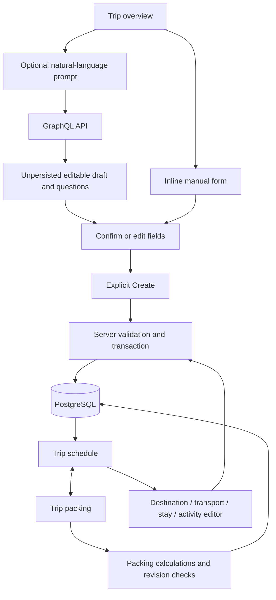
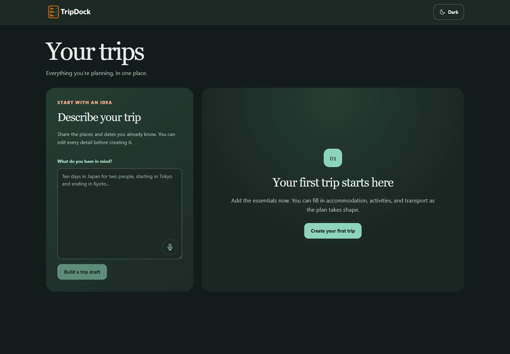
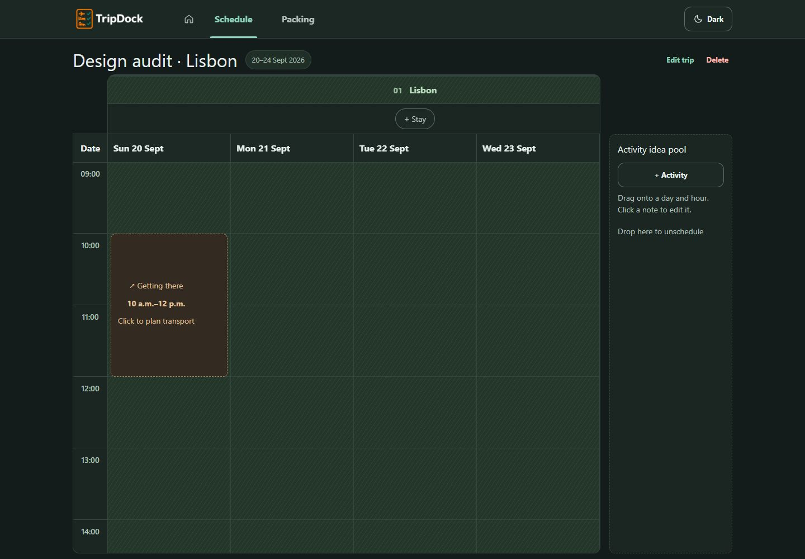
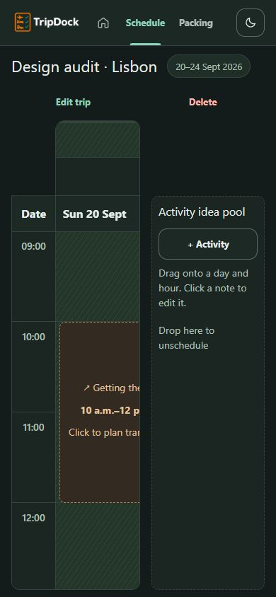
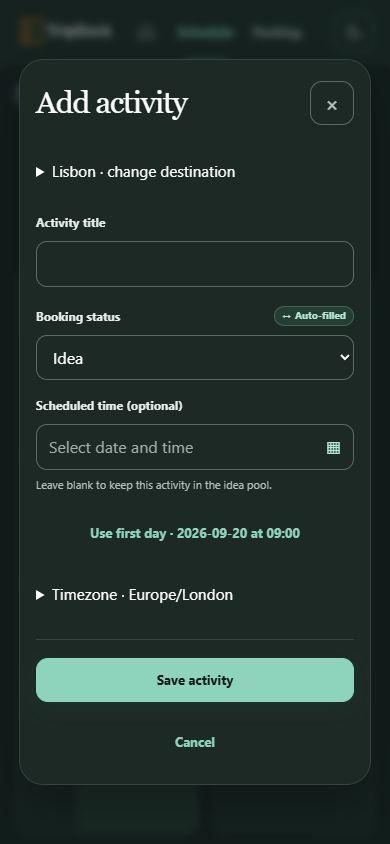
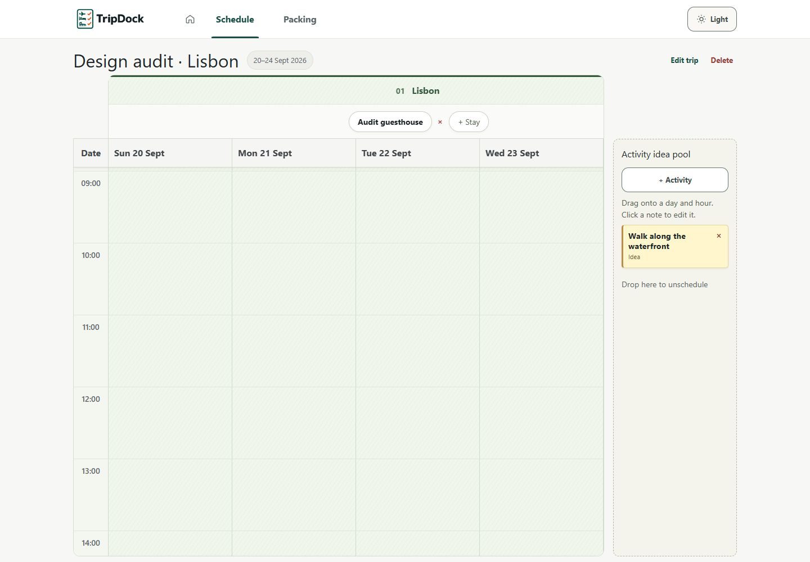
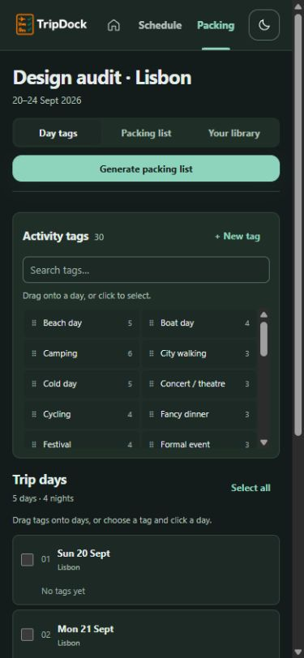
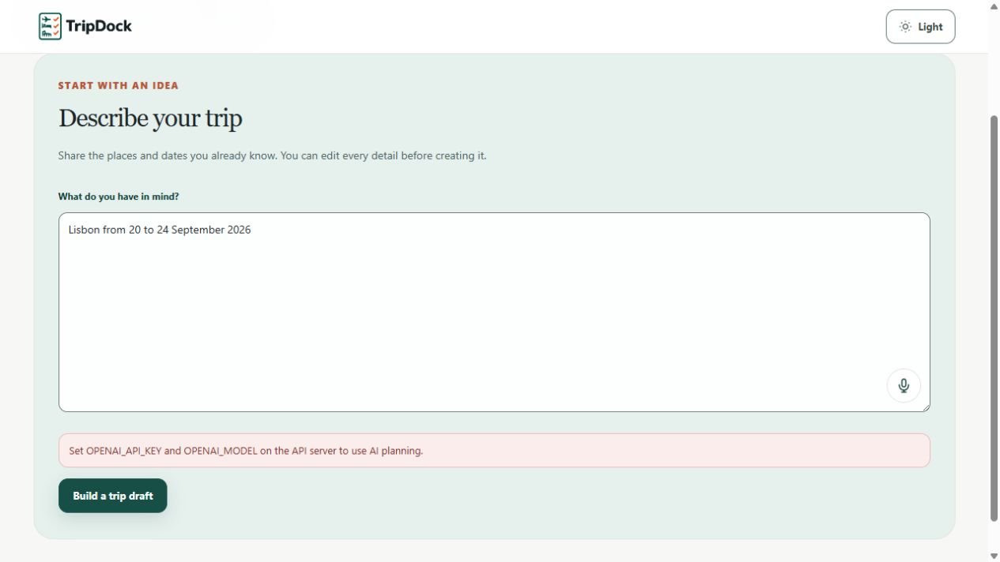

# Baseline map and design audit

## Product contract

The current code and README establish manual CRUD, optional server-generated drafts, explicit review before persistence, PostgreSQL as canonical storage, trip revisions, calendar scheduling, trip-scoped packing, and default dark mode. Historical documentation is not uniformly current: `docs/prototype-v0.md` still lists voice as deferred while `docs/voice-dictation.md` and the current UI implement it. The September 9 MVP review also predates external transport endpoints and later itinerary changes. These documents supply context, not instructions to remove working features.

Keep the supplied brand assets, serif overview headings, green controls, warm transport cards, destination patterns, inline expanding creation, and persistent Schedule/Packing navigation. The target is a better execution of this direction rather than a new visual identity.

## Responsibilities at the baseline

| Surface | Files and baseline symbols | Responsibility and implication |
| --- | --- | --- |
| Entry and themes | `apps/web/app/layout.tsx`, `globals.css`, `theme.css`, `components/theme-toggle.tsx` | Metadata, dark-first theme and shared visual primitives. Tokenized colors provide a useful foundation; repeated late overrides make responsive behavior difficult to predict. |
| Application shell | `components/trip-dock-app.tsx`, `TripDockApp` near line 1826 | Fetches trips, handles loading/error/empty, navigation, selected records and notices. |
| Creation | Same file, `TripFields` near 590, `CreateTripForm`, `TripsOverview` near 1689 | Manual input, provenance, AI clarifications, draft protection, transitions and explicit save. Mounted-state continuity matters. |
| Editing and deletion | Same file, `Dialog` near 137, editors near 1314–1641, `TripDetail` near 1643 | Native modal dialogs and revision-checked mutations. Confirmation dialogs precede destructive operations. |
| Calendar | `components/trip-calendar.tsx`, `lib/trip-calendar.ts`, `calendar-window.ts`, `calendar-interactions.ts` | Calendar layout, virtualization, gestures, notes, resize controls, date/time mapping. UI density and keyboard access must be verified together. |
| Packing | `components/packing-workspace.tsx`, `packing-days.tsx`, `packing-checklist.tsx`, `packing-library.tsx`, `app/packing.css` | Days/tags/list/library, saved quantities, deterministic regeneration and non-drag assignment. |
| API client | `lib/graphql-client.ts`, `packing-client.ts` | Requests, records, draft mapping and date helpers. The backend remains authoritative. |
| Dictation | `components/dictation-textarea.tsx`, `lib/voice-dictation.ts`, `live-recognition.ts` | Transient microphone state, editable transcript and explicit submission. Real audio requires a separately authorized provider check. |

Paths above are relative to repository root and refer to the baseline; frontend integration may move symbols. Git can recover the exact baseline with `git show f80de19:apps/web/components/trip-dock-app.tsx`.

The browser's selected view and unsaved inputs are transient. A screenshot alone proves rendering, not this persistence boundary. The audit therefore includes creation and reload against the isolated real database.

## Principal findings

| ID | Observation | Classification | Priority |
| --- | --- | --- | --- |
| D1 | At 390 × 844 the fixed 160 px calendar idea pool leaves approximately 182 px for the calendar. The date is partly visible, the transport text clips, and the destination/stay controls are centered offscreen. | Reproduced layout defect, not taste | High |
| D2 | At 390 px the overview's AI panel starts around y=284 and extends beyond the first viewport. Manual creation sits near y=1265 in the full-page capture. | Reproduced hierarchy/discoverability problem; severity is judgment | High |
| D3 | A single destination spans the trip's five days, but its centered heading and Stay action lie outside the initial narrow calendar viewport. Even after widening the calendar, long group headers can hide their actions. | Reproduced interaction discoverability problem | High |
| D4 | Calendar copy instructs dragging and dropping, while the activity editor already offers a precise date/time route. The alternative is less discoverable than the gesture. | Observed copy gap; keyboard helper code exists | Medium |
| D5 | Every hour cell is a Tab stop. For the five-day audit trip the table exposes 120 hourly cells plus record controls. | Source/AX evidence; keyboard efficiency concern | Medium, bounded follow-up |
| D6 | Default dialog initial focus is Close. Native dialog correctly excludes background from AX. Existing text fields and errors have labels/roles. | Strength with possible focus refinement | Preserve |
| D7 | Packing offers tag selection then day click, searchable tags and checklist items, quantity controls, collapsed details and status feedback. Its narrow view stacks the tag tray. | Reproduced strength | Preserve |
| D8 | Date pickers label full calendar dates, prevent end dates before start, return focus after selecting, and expose roving day focus. | Reproduced/source strength | Preserve and regression check |
| D9 | The AI prompt remains editable and the disabled create action explains the minimum requirements. Provenance text accompanies status colors. | Observed/source strength; successful generation not exercised live | Preserve |
| D10 | Opening Edit trip then pressing Escape closes the dialog but leaves `document.activeElement` as BODY. The invoking Edit trip button still exists. | Reproduced focus restoration defect | High |
| D11 | Saved destination names/dates are editable from the calendar, but the current schedule exposes no add/remove destination action. `StopEditor` and remove-stop API paths exist but are not wired to reachable schedule controls. The itinerary redesign explicitly removed add controls from the calendar. | Product-contract gap; historical direction explains it | Follow-up in Edit trip, not a new calendar toolbar |

## Screenshot evidence

Desktop overview has a balanced pair of entry surfaces and adequate whitespace. The manual and AI routes are both visible. The serif title supplies continuity with the established identity.

The mobile overview uses the same large surface heights and stacks the manual route below the AI form. This adds considerable scrolling before the fastest manual path.

Desktop calendar retains the recognizable paper grid, date row and idea pool. Horizontal panning is required to reach the final date in this five-day trip; that is acceptable for a two-dimensional planning surface if controls remain discoverable.

The narrow calendar is squeezed by its sidebar. This is caused by the final mobile rule in `globals.css` setting `grid-template-columns: minmax(0, 1fr) 160px`, overriding earlier one-column rules.

Read-only browser geometry measured calendar width 182 px at a 390 px viewport and 112 px at 320 px. Page scrollWidth equaled viewport width in both cases: the issue is internal clipping, so a page-overflow assertion alone would miss it. See `screenshots/baseline-measurements.json` and the matched populated screenshots for exact comparison data.

The activity dialog fits at 390 × 844 with visible labels and Save/Cancel. It uses the native modal top layer and clear contrast. Avoid replacing it solely for a different aesthetic.

The light variant retains the original palette. Text-token spot checks are healthy: ink/canvas 14.63:1 and muted/surface 6.09:1 in light; 14.69:1 and 7.96:1 respectively in dark. These are sRGB calculations for opaque token pairs, not an exhaustive composited-element audit. No palette replacement is justified by those samples.

Packing's mobile layout is already closer to the desired behavior: the tag tray gets its own row and the day list remains full width. Smaller metadata and dense list controls deserve future assistive-technology testing, but this is not evidence for a wholesale rewrite.

## Journey and state coverage

Baseline browser actions created `Design audit · Lisbon`, September 20–24, entered Lisbon as a city, saved `Walk along the waterfront` as an activity idea, assigned City walking to the first packing day using clicks, and generated a 14-item checklist. These requests used the production API and isolated PostgreSQL. Additional editing, reload and failure checks are recorded in the final verification report.

Further baseline checks saved `Audit guesthouse` with the suggested check-in/out dates, saved inbound `Audit flight to Lisbon` from London, and checked Day bag in the packing list. Reload retained the day assignment and showed Packing list · 1/14 with Day bag checked. Schedule/Packing arrow-key focus movement worked. Edit trip correctly disabled Save changes before any change.

At 320 px, the date popup in Edit trip measured left 12 px, right 308 px, width 296 px; it stayed within the viewport. Destination editing exposed name, start/end dates and a disabled unchanged Save action. These controls should be preserved. No saved-destination add/remove/reorder UI journey is claimed: the current reachable surface does not supply one.

The unconfigured-AI path returned a clear configuration error and retained the typed Lisbon prompt. It made no provider request. Its technical recovery message is suited to local setup, but does not directly offer manual creation; Back to trips remains available.

The native trip-deletion confirmation stalled the in-app browser automation transport. No confirmation acceptance was sent, and a fresh tab still showed the saved trip. This limits browser evidence for baseline cancellation/deletion; it is not evidence that TripDock deleted a record or that its confirmation logic is wrong. The stalled temporary tab could not be closed through the documented API. Subsequent checks use a new tab in the same browser.

Loading appeared during initial fetch and reload, with a named opening state. The empty database displayed no fake trips. Manual creation transitioned into an inline form and exposed its readiness explanation. A native activity dialog showed the background as inert, and its form retained an explicit optional scheduling hint. Destructive controls invoke a browser confirmation; final deletion tests must use only the disposable audit data.

AI successful draft/clarification screens require injected test responses or provider calls. No live provider call is authorized here. Source review and deterministic tests can establish field-state mapping and persistence boundaries, but cannot establish live extraction quality, speech recognition quality, screen-reader announcements or microphone permission behavior. These limits remain explicit in the final report.

## Audit limits

The tested mobile sizes are Chromium viewport emulation, not a physical iPhone or Android handset. No representative-user study, NVDA/VoiceOver session, full automated accessibility certification, or every calendar duration/timezone permutation is claimed. The findings distinguish directly reproduced behavior from source-informed risks and subjective prioritization.
