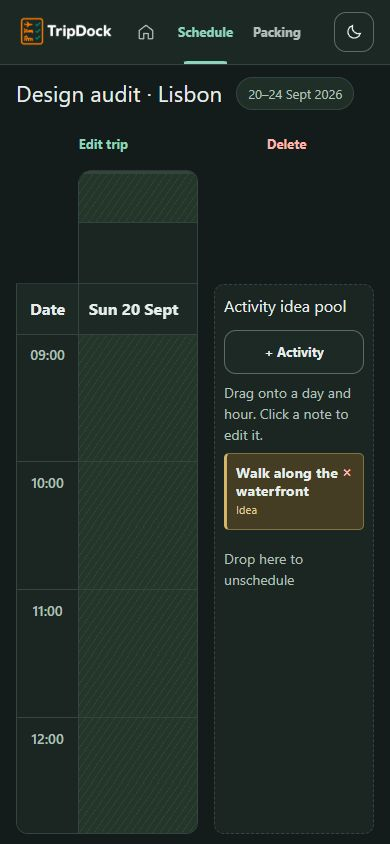
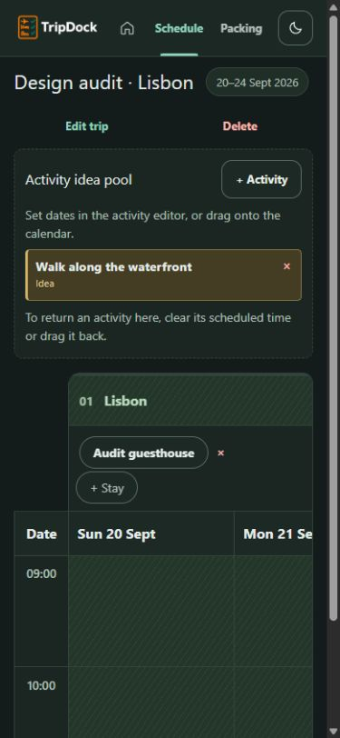

# Implementation and verification

The completed changes restore usable calendar space on phones, bring manual creation into the first viewport, and correct focus behavior. Frontend commit `b707850793d94e78467a243750e16bd6a27cd829` was merged first in `89459a8`; design work uses its extracted owners. Backend work remains separate.

## Implemented decisions

| Finding | Completed change | Owner (under apps/web) |
| --- | --- | --- |
| D1: mobile sidebar squeezes calendar | At up to 800 px, put a bounded idea pool above a full-width calendar. Allow page scrolling, retaining internal calendar scrolling and a usable minimum height. Desktop keeps its side-by-side arrangement. | `app/globals.css`, `features/calendar/trip-calendar.tsx` |
| D2: manual entry buried beneath AI creation | Add the established **+ New trip** action to the empty overview header below 900 px. Reuse the existing mounted form and callback. Remove excessive mobile card heights, increase field-label readability and keep the form heading visible after opening a lower-page action. | `features/trips/trips-overview.tsx`, global CSS |
| D3: grouped actions outside mobile viewport | Constrain destination/stay controls in horizontal sticky containers. Supply the real scrollport width through the existing ResizeObserver. Retain existing editors and mutations. | Calendar owner and global CSS |
| D4/D5: drag-first wording, long keyboard route | Explain scheduling and clearing dates through the editor. Put the pool first in DOM order while CSS retains its desktop position. Add calendar scroll padding so focused cells clear the sticky header. | Calendar owner and global CSS |
| D10: Escape loses invoker | Capture focus before showModal and restore it during cleanup if the invoker remains connected. Retain native dialog and nested date-picker Escape semantics. | `components/ui/dialog.tsx` |
| Screenshot follow-up: title obscured on navigation | Reset page scrolling instantly and focus main content with preventScroll, keeping the title below the sticky header. | `components/trip-dock-app.tsx` |

No dependency, asset, API contract, migration, provider setting or runtime persistence mechanism was added. Calendar indexing, windowing and mutation helpers remain intact. Existing forms stay mounted when changing creation modes.

The first full gate rejected “Start manually” through an existing product-copy assertion. The final shortcut uses the established “+ New trip” convention; the assertion was retained. The new dialog focus assertion failed on the inherited implementation and passed after the fix. Screenshot inspection found the navigation/title issue; its fix gained a heading-versus-header geometry assertion.

## Responsive results

| Viewport | Calendar before | Calendar after | Observation |
| --- | ---: | ---: | --- |
| 320 × 844 | 112 px | 273 px | Readable first day beside time column; Lisbon, stay and + Stay visible. |
| 390 × 844 | 182 px | 343 px | Full content width below the pool. |
| 768 × 1024 | — | 736 px | Several readable day columns and visible grouped controls. |
| 1440 × 1000 | Desktop reference | Arrangement retained | Calendar left, 220 px pool right; both themes reviewed. |

These are DOM measurements in the real Vinext app. At 320/390 the browser reserves 15 px for its page scrollbar; page gutters use another 32 px. Document scroll width equals client width at measured narrow sizes. Baseline page-overflow checks also passed despite the internally squeezed calendar, so width and action visibility are necessary checks. At 390 px, panning the calendar horizontally by 375 px kept Lisbon visible. Keyboard Tab into the 00:00 row placed the focused cell at y=298, directly below the sticky header ending at y=298.

At 390 × 500, the activity dialog remained contained and internally scrollable; Cancel was reachable and closed it. This is viewport emulation, not a physical-device virtual-keyboard check.

## Visual evidence

The following real-app screenshots use the same isolated PostgreSQL trip, stay and activity idea. Calendar scroll position can differ; these are reviewed visual comparisons, not pixel-diff assertions.

| Before, 390 px | After, 390 px |
| --- | --- |
|  |  |

Other inspected captures: [320 dark](screenshots/after-320-schedule.png), [320 light](screenshots/after-320-light-schedule.png), [tablet light](screenshots/after-tablet-light-schedule.png), [desktop dark](screenshots/after-desktop-schedule.png), [desktop light](screenshots/after-desktop-light-schedule.png), [short-screen editor](screenshots/after-short-mobile-editor.png).

The [after empty mobile overview](screenshots/after-mobile-empty-test.png) mounts actual components through the browser test harness with an intercepted empty GraphQL collection. It demonstrates layout only, not database persistence. The [baseline empty overview](screenshots/before-mobile-empty.png) came from the real app before audit data was created.

## Final automated checks

`pnpm check` passes: **108 web tests and 81 API tests**, zero failures, one optional PostgreSQL test skipped; lint, typechecks and both builds pass. See [complete output](pnpm-check.txt). Vinext retains its informational unknown-route classification message.

`pnpm --filter @tripdock/web test:browser` passes **seven Chrome flows** under StrictMode. Four inherited flows cover manual create/edit/reload, editable AI review, connection retry and essential clarification before save. Three added cases at 320/390/768 px cover early creation access, title clearance, retained manual input, lower-page entry scrolling, full calendar width, visible destination/stay actions and dialog focus restoration. The nested Escape flow now asserts return to Edit trip. See [browser output](browser-tests.txt).

The harness intercepts GraphQL on port 3312. It verifies UI behavior and request boundaries, not PostgreSQL or provider output. Runtime was Node 24.21.0 with pnpm 11.19.0; the repository pins Node 22.23.2. A pinned-Node gate remains an integration check.

## Actual post-change persistence and interaction checks

- Scheduled **Walk along the waterfront** for September 20 at 09:00 through the editor, saved and reloaded. It appeared in that calendar cell. Cleared the optional scheduled time, saved and reloaded; it returned to the idea pool. This verifies the non-drag workflow described by the new instructions.
- Opened Add activity and pressed Escape in the actual app; focus returned to **+ Activity**. Checked horizontal panning and sticky-header focus clearance.
- Reopened Packing after the changes. **City walking** remained assigned to September 20 and completion remained **1/14**.

## Baseline evidence

- Dependencies installed from the existing lockfile using pnpm 11.19.0.
- Existing migrations applied to the new isolated PostgreSQL 17 database `tripdock_design_audit` on port 55439.
- Real UI at port 3301 and real API at 4301, no provider credentials.
- Desktop 1440 × 1000 and mobile 390 × 844 baseline captures saved in `screenshots/`.
- UI created a trip, saved an activity idea, assigned a packing tag by clicking and generated a deterministic packing list.
- `pnpm check` baseline passed with exit code 0: tests, lint, typechecks and both builds. API: 81 passed, one optional real-PostgreSQL test skipped. Runtime: Node 24.21.0 (repository pins 22.23.2); pnpm 11.19.0.
- Reload preserved City walking on September 20, Day bag checked and the 1/14 packing count. Saved stay and inbound transport appeared in the trip overview counts in a fresh tab.
- Unconfigured-AI failure retained the prompt and displayed its configuration message, without any live provider call.
- Native browser delete confirmation stalled the automation transport; no acceptance was sent. A fresh tab showed the trip intact. Baseline delete/cancel browser evidence is incomplete.
- Editor Escape closed the modal but left focus on BODY: recorded for correction after frontend integration.

## Remaining scope and limitations

- D11 is superseded by the [follow-up decision](05-follow-up-decisions.md): destinations should be fixed after creation. Destination management is intentionally deferred until a whole-trip editing flow addresses dependent activities, stays, transport and packing. It is no longer a discoverability improvement to implement now.
- D5: many hourly Tab stops remain. A complete keyboard model needs to account for calendar windowing and receive assistive-technology testing. No partial ARIA grid was introduced.
- Actual delete/cancel evidence remains incomplete because native confirmation stalled CUA. No acceptance was sent and a fresh tab showed the trip intact.
- No physical mobile device, screen reader, production-server hydration or live AI/audio-quality session was run. Opaque token contrast checks are not a full accessibility certification. No representative-user usability study was conducted.

## Integration and rollback

Integrate `codex/overnight-design` with awareness that it already includes frontend `b707850`. Design documentation checkpoints are `a8b8585`, `4522886`, `8aa8d75`; merge `89459a8` records frontend integration. The final design commit is reported in the task handoff. The original checkout's untracked MVP review remains untouched.

The final design changes can be reverted as one commit while retaining the frontend merge and earlier research. Keep backend integration and verification separate. Nothing was merged to main or deployed.
