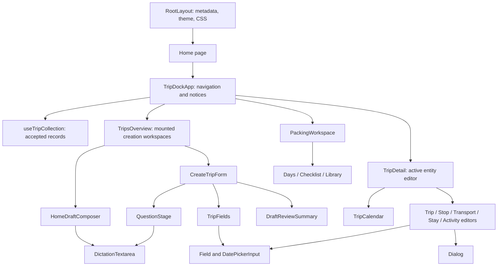
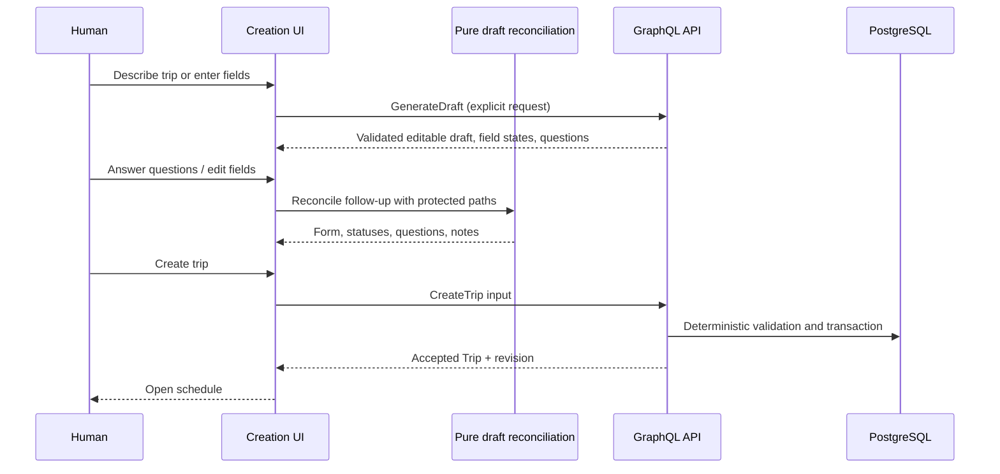

# Frontend baseline and file map

## Entry points and responsibilities

TripDock is a single-route React application rendered through Vinext's App Router integration. [page.tsx](../../../apps/web/app/page.tsx) renders `TripDockApp`. [layout.tsx](../../../apps/web/app/layout.tsx) supplies metadata, icons, the dark-first theme bootstrap, global styles and the document shell. Neither entry loads trip data on the server. The client queries the existing GraphQL API after mounting.

[vite.config.ts](../../../apps/web/vite.config.ts) combines Vinext, the Sites plugin, Tailwind's PostCSS plugin and Cloudflare's RSC environment. The checked-in Sites metadata is prototype lineage, not a decision to deploy the PostgreSQL product. [ADR 0001](../../decisions/0001-local-first-development-with-live-openai.md) explicitly leaves the runtime/provider decision open.

Navigation is a hash subscription in [packing-navigation.ts](../../../apps/web/lib/packing-navigation.ts): `#trip/<uuid>/schedule` and `#trip/<uuid>/packing`, plus legacy packing links. The selected trip is derived from that ID and the accepted collection. It is not a second mutable copy of the record. The file's historical packing name understates its application-wide responsibility; renaming it was deferred to avoid unnecessary downstream import changes.

The diagram describes the resulting tree. Before extraction, all nodes from `Logo`, `Dialog` and `Field` through `TripsOverview`, creation and five entity editors were definitions inside `components/trip-dock-app.tsx`.

## Measured baseline

The measurements count physical lines and bytes, top-level named component declarations, and syntactic `useState`/`useEffect` calls. They are reproducible structural indicators, not a cyclomatic-complexity score, runtime performance benchmark or assertion that shorter code is always better. Dense JSX makes bytes a useful complement to lines.

| Measure | Baseline | Result |
| --- | ---: | ---: |
| App master module lines | 1,910 | 70 |
| App master module bytes | 102,095 | 5,552 |
| Components defined in app module | 16 | 1 |
| State hooks in app module | 49 | 1 |
| Effect hooks in app module | 7 | 2 |
| Production modules containing multiple component definitions | 5 | 0 |
| Former GraphQL catch-all module lines | 1,275 | 9 compatibility-export lines |
| App/component/feature/lib/CSS files in measured set | 24 | 65 |

This is redistribution of real responsibilities, not removal of the product's state. The new 24-line collection hook has a single purpose. Creation still owns its own 13 state hooks, and packing owns its requests separately. No new application-wide store was added.

The original `graphql-client.ts` mixed wire types, HTTP requests, query strings, timezone conversions, editable draft validation, destination identity alignment, follow-up prompt construction and stop-date linking. That made even a date formatting import conceptually point at the entire API-and-draft subsystem. New production imports identify the responsible module directly; the compatibility facade lets existing tests and downstream branches migrate incrementally.

Duplication is mostly procedural rather than duplicated components. Five entity editors repeat busy/error/save scaffolding, but differ materially in normalization, nullable timestamps, endpoint representation and expected-revision arguments. A generic field-schema editor would hide these differences. Shared `Dialog`, `Field` and `DatePickerInput` retain the actual common responsibilities. Two question stages formerly shared a nested render function; `QuestionStage` now makes that shared presentation discoverable.

## State and data ownership

| State | Owner | Lifetime and authority |
| --- | --- | --- |
| Trips and revision numbers | API/PostgreSQL; accepted client copy in `useTripCollection` | Reload queries API; successful mutations replace the full returned trip. |
| Selected trip/view | Hash navigation | Parsed UUID/view; back/forward subscription, no duplicated trip object. |
| Current entity editor | `TripDetail` discriminated union | One dialog kind at a time; forms own unsaved values. |
| Creation mode and animation | `TripsOverview` | Retains mounted forms across closing/reopening; refs manage geometry and focus. |
| Draft fields/questions/protected paths | `CreateTripForm` | Unpersisted until explicit create; follows stable destination identity rules. |
| Date-link dirty markers | `TripFields` | Remapped when destination order/identity changes; distinct from accepted trip data. |
| Collection request attempt | `useTripCollection` | Initial load and retry share cleanup; abort prevents late results from publishing. |
| Packing library and plan | `PackingWorkspace` | Separate API responses; pending/version refs prevent overlapping edits and obsolete plan responses. |
| Calendar hover/drop feedback | Calendar interaction object | Cell-specific external subscriptions; transient, never canonical itinerary data. |
| Microphone session/transcript | `DictationTextarea`, `VoiceDictation`, `LiveRecognition` | Editable text; explicit submit; session cleanup on inactivity/unmount. |
| Theme | Theme bootstrap and toggle | Dark default; explicitly permitted local preference storage only. |

Derived state includes the selected trip, sorted destination routes, minimum creation readiness, omitted unresolved destination ideas, filtered clarification questions, packing progress and calendar event indexes. These remain calculations, rather than new synchronized stores.

## Request and draft flows

The transport boundary in [request.ts](../../../apps/web/lib/graphql/request.ts) sends GraphQL documents/variables, forwards abort signals and reports network, HTTP, GraphQL and empty-response errors. Generic TypeScript result parameters describe the expected wire shape; they are not runtime validation. The API remains responsible for authoritative schema/domain validation. Operations and selected trip fields are unchanged.

Follow-up reconciliation in [merge-follow-up.ts](../../../apps/web/features/trips/creation/merge-follow-up.ts) is pure: align incoming destinations; remap statuses and protected paths; identify explicitly answered paths; retain unanswered questions; protect stable/manual fields; merge; return the next draft state. Network initiation and publishing state remain in the form. This boundary exposes the hard behavior to tests without moving every hook into a controller.

Entity save handlers remain with their forms because each owns its conversion rules. Transport distinguishes internal stops from external endpoints. Stay and activity editors preserve original instants when local displayed times are unchanged. All accepted updates retain revision checks. Existing-trip AI editing remains absent.

## Styling, copy and accessibility

`globals.css` is 2,375 lines/76,062 bytes; `packing.css` is 164 lines/15,371 bytes; `theme.css` is 209 lines/12,023 bytes. The global file imports packing styles, then the layout imports theme overrides. Large compressed rules and repeated selector overrides make styling the largest remaining shared editing surface. Structural extraction intentionally changes none of them.

Copy remains near its owning view. Field status labels form a small typed presentation map in `Field`; GraphQL field names, statuses and route IDs remain structured data. Moving all strings to a global dictionary would increase navigation work without a translation requirement. Server clarification text is data supplied by the API and stays separate from frontend labels.

The shared controls retain label/control IDs, hint descriptions, invalid-state attributes, keyboard date movement, popup Escape handling and native modal semantics. Inactive creation panels remain inert. The app retains its skip link, notices, tab roles and navigation focus behavior. These mechanisms are contracts to preserve, not proof of complete accessibility. In particular, explicit modal focus restoration, small-screen calendar navigation and reachability of grouped controls remain design-audit work.

## Contributor map

| Task | Start here |
| --- | --- |
| App navigation/accepted loading | `components/trip-dock-app.tsx`, `features/trips/use-trip-collection.ts` |
| Home composition/creation animation | `features/trips/trips-overview.tsx` |
| AI/manual creation | `features/trips/creation/create-trip-form.tsx`, `question-stage.tsx`, `merge-follow-up.ts` |
| Shared trip field linking | `features/trips/trip-fields.tsx`, `lib/trips/stops.ts` |
| Draft semantics | `lib/trips/drafts.ts`, `draft-alignment.ts`, `types.ts` |
| Manual entity editor | `features/trips/editors/<entity>-editor.tsx` |
| Itinerary rendering | `features/calendar/trip-calendar.tsx`; neighboring cell/pool/paper/resize files |
| Packing views | `features/packing`; network helpers in `lib/packing-client.ts` |
| GraphQL contract/request handling | `lib/trips/operations.ts`, `lib/graphql/request.ts` |
| Dialog/field/date accessibility | `components/ui` |
| Dictation | `components/dictation-textarea.tsx`, `lib/voice-dictation.ts`, `lib/live-recognition.ts` |
| Deterministic behavior | `tests/*.test.ts`; browser composition in `tests/browser` |

The remaining largest TSX module is the calendar at 330 lines/30,866 bytes. Its six state hooks, indexed data model and pointer interactions are cohesive but its JSX is still dense. That is a specific future decomposition candidate, not a reason to replace the optimized calendar or add a general calendar dependency.
