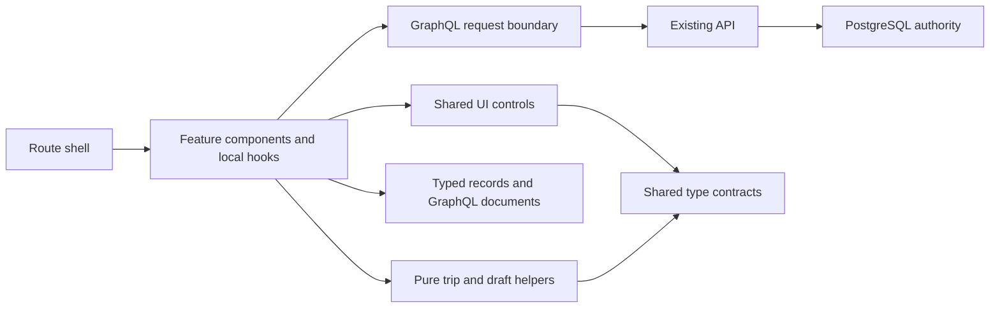

# Frontend target and decisions

## Target

A contributor should locate a visible component by name, identify its state owner and find its server contract without reading unrelated product flows. Each feature owns its UI and local interaction state. Pure domain helpers stay independent of React. The application shell composes features and owns only application-level concerns.

Dependency direction is important. Data helpers must not import feature components, and production must not import test fixtures. The compatibility facade is for existing consumers during migration; new production imports point directly to the responsible module. The frontend structural test enforces these basic rules and the one-component-per-file preference.

## Decisions and alternatives

| Decision | Chosen default and reason | Alternative / complication | Rollback |
| --- | --- | --- | --- |
| Component organization | Feature folders plus shared controls; one named component definition per file. Natural independent edit scopes. | Pure atomic-component hierarchy would scatter related forms; keeping one file retains conflict/search costs. | Revert the refactor commit; there is no data migration. |
| Accepted trip state | Small `useTripCollection` hook; returned server records replace accepted copies. | Query cache becomes useful with repeated consumers/refetch/invalidation needs. A UI store does not itself solve remote caching. | Restore shell-owned loading; retain abort cleanup when doing so. |
| Draft state | Form-owned state with pure `mergeFollowUp`; explicit create is the only persistence step. | Feature reducer is plausible as transitions grow; doing it with identity/DOM extraction raises regression risk. | Pure function can be inlined with equivalent inputs/outputs; protected-path behavior must remain tested. |
| Manual editors | Individual forms, explicit conversion and revision arguments; shared accessible controls. | Generic form schema reduces boilerplate but obscures distinct transport and time semantics. | Each editor can move independently; no backend contract change. |
| GraphQL | Split transport, documents, types and pure helpers; preserve former import facade. | Generated documents/types require backend workflow ownership and drift checks. | Existing facade keeps older imports working. |
| Styling | Keep all current selectors, rules, tokens and import order; document owners. | Immediate CSS Modules conversion introduces cascade churn alongside architecture work. | No style rollback is needed for this branch. |
| Copy | Colocate feature prose; retain typed status presentation where shared. | Global i18n catalogue adds key indirection without a translation requirement. | Copy stays ordinary source text. |
| Calendar | Preserve optimized data preparation and cell subscriptions; extract named controls. | New calendar/drag dependency risks changing established geometry and behavior. | Component extractions are mechanical; preserve optimized helpers and tests. |
| Browser verification | Pinned Playwright dev dependency; test-only Vite entry and intercepted GraphQL. | Real API/DB browser tests prove more integration but require an explicitly isolated database and service orchestration. | Remove the test harness/dependency without runtime changes. |
| Runtime | Retain Vinext/Next/Vite versions and current route. | Framework migration changes too many independent concerns; requires dedicated compatibility assessment. | No runtime migration to reverse. |

These defaults are feasible now because they reuse existing component boundaries and pure helpers. The only added package is a development-only browser test runner. File count grows, but discoverability improves and no new production state framework is introduced.

## Priorities and completion gates

### P0 — Completed in this branch

- Extract all top-level components from multi-component production files, including packing and calendar controls.
- Isolate GraphQL transport and operation strings from trip date/draft helpers; preserve the old import surface for integration.
- Extract a bounded accepted-collection hook and test late response suppression, failure/retry and accepted record updates.
- Expose follow-up reconciliation as a pure function and test manual protection and unanswered essential questions.
- Keep trip creation modes, existing CSS, selectors, operation documents and server validation behavior intact.
- Add reusable contributor guidance and browser flows that operate only on test-owned data.

Acceptance requires deterministic checks, the browser smoke and a final diff review. Successful extraction means both a navigable file tree and preserved observable behavior; moving lines alone is insufficient.

### P1 — Next focused design/integration work

1. **Shared dialog focus restoration.** The existing native-dialog behavior deserves explicit invoker restoration and a browser assertion. Ownership is now `components/ui/dialog.tsx`. Preserve nested date-picker Escape and connected-invoker checks.
2. **Mobile calendar and grouped controls.** Review reachability, horizontal navigation and idea-pool placement on narrow viewports. Ownership is `features/calendar` plus the unchanged global/theme styles. Preserve cell subscription/windowing behavior.
3. **Real runtime integration smoke.** After backend/design integration, exercise create → clarify → review → save → edit → reload against an isolated PostgreSQL database and the actual Vinext server. The intercepted browser harness cannot claim this result.
4. **CSS ownership pass.** Move coherent feature sections only when their full cascade can be compared in both themes and production output. Keep shared controls and tokens central. Do not rename every selector merely to adopt a style convention.

### P2 — Triggered maintenance, not automatic expansion

- Extract calendar event/card subviews when changing those interactions, keeping narrow props and prepared data.
- Consider a creation reducer if new transitions make state combinations hard to audit. Reuse pure reconciliation and preserve existing assertions.
- Split the remaining pure `drafts.ts` by readiness versus follow-up prompting if multiple contributors regularly edit those independent concerns.
- Consider typed GraphQL generation only with a backend-owned generation/check command and a documented source schema.
- Consider a remote-query library when multiple mounted consumers require reliable deduplication or invalidation. Define the failing behavior first.

## Integration and concurrent editing

The design task should integrate the frontend commit before modifying extracted UI files. Its old main-file targets move to `components/ui`, `features/trips/creation`, `features/trips/editors`, `features/calendar` and `features/packing`. CSS paths are unchanged. The backend task owns `apps/api`; this branch does not modify it.

The old `components/trip-calendar.tsx` and `components/packing-*.tsx` paths are removed, so downstream component imports must be adjusted. `components/trip-dock-app.tsx` remains the application entry. The `lib/graphql-client.ts` facade deliberately preserves existing helper/type imports during integration. Future code should use the focused data modules, and the architecture test rejects production use of the facade.

Use a normal local merge or cherry-pick from the reported commit in the target worktree, inspect conflicts, run `pnpm install --frozen-lockfile`, `pnpm check`, then the browser smoke. Resolve moved-file conflicts by porting the actual behavior change into the new owner rather than restoring the monolith. Do not merge to main automatically.

## Decisions requiring attention

No routine architecture or design approval blocks this branch. Current data and provider settings are preserved. Live billed AI evaluation, deployment, database deletion and multi-user scope remain separately authorized actions. Production runtime/provider selection can wait until there is an actual hosting requirement. Chrome is the verified browser for this harness; other browser channels and production hydration remain explicit verification gaps.
