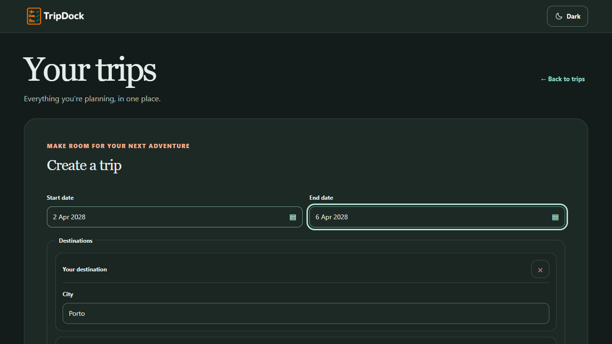

# Implementation and verification

## Implemented result

The former 1,910-line application file now contains a 70-line composition component. All five production files with multiple top-level component definitions have been decomposed. Shared controls are discoverable in `components/ui`; trips, calendar and packing have feature folders. The 1,275-line GraphQL/helper module is a nine-line compatibility facade backed by focused transport, operation, type, date, stop and draft modules.

Two behavioral boundaries are now explicit. `useTripCollection` owns accepted server records and shares request cancellation between initial load and retry. `mergeFollowUp` reconciles incoming drafts with manual protection and unanswered questions without React or network dependencies. `QuestionStage` owns the shared clarification/refinement presentation. The form still owns draft state and explicit persistence; no giant controller hook or new global store was introduced.

The refactor preserves GraphQL documents, field selection, revisions, time conversion rules, draft readiness and destination alignment. No CSS, theme rule, brand asset, application AI configuration, hosting metadata, API source or database migration changed. The original checkout's untracked MVP review was preserved.

## Verification results

Verified on Windows with Node **24.21.0** and pnpm **11.19.0**. Node differs from README's pinned **22.23.2**; this is an environment limitation, not a claimed pinned-runtime verification.

| Check | Result |
| --- | --- |
| `pnpm install --frozen-lockfile` before implementation | Passed after retrying outside the sandbox; existing lockfile reused. |
| `pnpm check` after final source/test changes | Passed: 108 web tests; 81 API tests passed and one optional PostgreSQL test skipped; both linters, both typechecks and both production builds passed. |
| `pnpm --filter @tripdock/web test:browser` | Four Chrome tests passed in 7.6 seconds including test server setup. |
| Same browser harness against copied `f80de19` source | First three flows passed; captured baseline screenshots. The fourth clarification scenario was added afterward. |
| Before/after screenshots | Home, filled manual form and saved schedule PNGs have identical SHA-256 values at 1280×720. |
| Declaration comparison against baseline | 119 top-level declarations have identical text after removing only the added `export` prefix. Only `TripDockApp` and `CreateTripForm` differ, as intended. Imports and newly extracted reconciliation/question presentation were reviewed separately. |
| `git diff --check` | Passed. |

The [full final gate output](evidence/pnpm-check.txt) records the test/build results. [Baseline metrics](baseline-metrics.json) and [current metrics](current-metrics.json) record every measured frontend module. [Extraction comparison](evidence/extraction-review.json) identifies moved declarations and the two intentionally changed owners.

The sandboxed gate initially failed before API tests ran: `tsx` encountered Windows `uv_os_get_passwd` / `ENOMEM`. The unchanged command passed outside the sandbox. The first browser run also could not terminate its test server cleanly inside the sandbox; the unrestricted run completed normally. These are environment observations, not suppressed product test failures.

Browser development found and corrected test assumptions: a date locator needed a day boundary to distinguish 2 April from 12/22 April, and the retry fixture had to remain offline through StrictMode's setup/cleanup cycle until the explicit recovery action. A draft fixture claiming a missing end date initially still contained a stop departure date; it was corrected to represent a genuinely unknown end, retaining the assertion that the unanswered essential remains missing and blocking.

## Behavior exercised

- **Manual creation:** empty home → create form → enter city/dates/name → close/reopen with retained values → create → edit accepted trip with expected revision → reload from intercepted API → open date picker → Escape closes picker → Escape closes editor.
- **Editable AI draft:** generate → review without a saved trip → manually change the trip name → follow up → retain that name → explicit create. The intercepted API records exactly two draft requests and one create request.
- **Connection recovery:** HTTP 503 is visible; explicit retry loads a genuinely empty collection.
- **Essential clarification:** incomplete draft opens the question stage; continue remains disabled before a radio answer; selected structured date updates produce a reviewable draft; only Create persists the test record.
- **Request lifecycle units:** abort suppresses a late success and an obsolete failure; a fresh request can recover; accepted-record replacement/removal retains unrelated records and does not mutate the input state.
- **Draft reconciliation units:** a manual name survives an unrelated follow-up; unanswered essential questions remain blocking even when the next provider-shaped response omits them.

Tests never call a real AI provider. The browser harness renders actual components under StrictMode, with a test-runner-owned GraphQL response store. Its reload test proves re-query and rendering of accepted responses, **not real PostgreSQL persistence**. It is a client composition smoke, **not a Vinext production hydration test**. Existing deterministic API tests provide separate integration coverage through their isolated harness; the optional real-PostgreSQL smoke was not run here.

## Visual evidence

All pairs below are byte-identical PNGs. They cover the sampled desktop states, not every screen size or interaction. Global, packing and theme CSS files are unchanged in Git.

| State | Before | After | SHA-256 |
| --- | --- | --- | --- |
| Home | [Before](evidence/before-home.png) | [After](evidence/after-home.png) | `02f0863142e8394b561c2c8ada7afca5d5850d1d635c1877ad01776f04d0865f` |
| Manual form | [Before](evidence/before-manual-form.png) | [After](evidence/after-manual-form.png) | `dbb012a6621125bd0d43b7fa3fafd2fd4d8ba1ec4ad3f04df888eb9c625f9478` |
| Saved schedule | [Before](evidence/before-saved-trip.png) | [After](evidence/after-saved-trip.png) | `e45504b8880c7a03a8f3b3f6b916873f133154f7faa6bedea15efa14d507c458` |

## Integration handoff

Branch: **`codex/frontend-architecture`**, based on **`f80de19f32b39b2b77b940a480fabf4d6cebcd62`**. The final task response identifies the integration commit. Nothing was merged to main or published.

Integrate the commit into the design worktree before editing the moved UI modules. Keep the target worktree's uncommitted work safe, inspect moved-file conflicts, install the updated lockfile, run `pnpm check`, then `pnpm --filter @tripdock/web test:browser`. `components/trip-dock-app.tsx` remains the stable entry. Direct imports of removed calendar/packing component files must use the feature paths listed in the map. Existing `lib/graphql-client` consumers remain compatible while migrating.

The browser harness owns port **3312**, uses no database and stops at the end of the test run. It does not reuse the design task's app/API ports. `TRIPDOCK_BROWSER_BASELINE=1` is a test-only local comparison switch requiring copied baseline source in ignored `.cache/baseline-web`; it is not a runtime app mode. Normal contributor verification leaves it unset.

Rollback is a normal revert of the refactor commit after checking downstream edits. There is no data/schema migration to reverse. A downstream feature branch should preserve its intentional changes when porting them back across a revert.

## Remaining work and morning attention

The focused design follow-up owns dialog invoker focus restoration, narrow calendar/pool layout and grouped-control reachability. The calendar still has dense rendering code, `CreateTripForm` still owns a substantial local state transition surface, and `drafts.ts` is 451 lines. Their owners are now explicit, and the target plan identifies when further decomposition is worthwhile.

Verify the integrated app against an isolated real PostgreSQL database and the actual Vinext server. Repeat on the pinned Node version when available. Full mobile, touch, screen-reader and non-Chrome checks are not established by this branch. Live model quality, billed dictation, deployment and external-user access were intentionally outside verification.

No routine architecture decision requires morning approval. Integration and review of these explicit verification gaps are the next steps. A cross-task status notification was rejected by automatic approval review; branch/commit information is therefore delivered through this review pack and final task response rather than claiming that notification succeeded.
